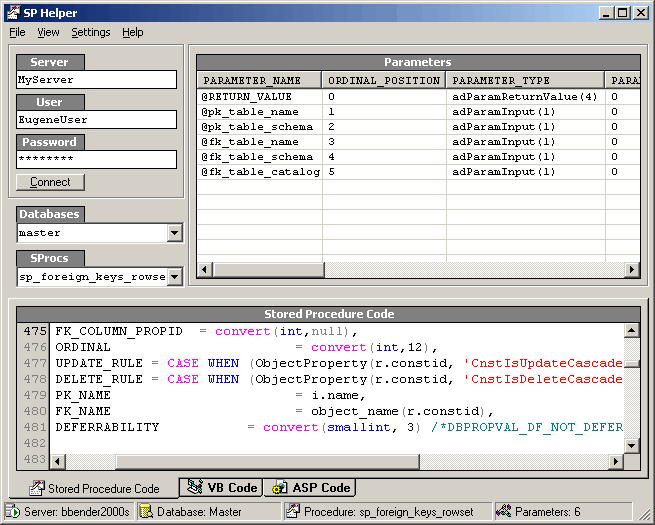



## Stored Procedure Helper

### Description

This is an application that allows you to connect to a database and view all the properties of a stored procedure and writes the VB and ASP code for you to run each particular sproc you are viewing. It is a pain to have to write wether a sproc parameter is inout or output and what type of parameter and what is the max length...etc. Just point to the sproc and all the code is created. There's even setting based on how you would like the code written for you.
 
### More Info
 

             |
---                |---
**Submitted On**   |2001-11-21 16:38:08
**By**             |[Brian Bender](https://github.com/Planet-Source-Code/PSCIndex/blob/master/ByAuthor/brian-bender.md)
**Level**          |Intermediate
**User Rating**    |5.0 (60 globes from 12 users)
**Compatibility**  |VB 6\.0, VB Script, ASP \(Active Server Pages\) 
**Category**       |[Databases/ Data Access/ DAO/ ADO](https://github.com/Planet-Source-Code/PSCIndex/blob/master/ByCategory/databases-data-access-dao-ado__1-6.md)
**World**          |[Visual Basic](https://github.com/Planet-Source-Code/PSCIndex/blob/master/ByWorld/visual-basic.md)
**Archive File**   |[Stored\_Pro3754511262001\.zip](https://github.com/Planet-Source-Code/brian-bender-stored-procedure-helper__1-29226/archive/master.zip)

